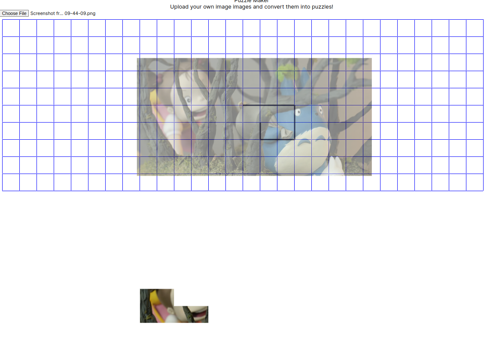

# Image-Grid-Cropper
## A Proof of Concept
### App that allow you crop up your uploaded images in a grid-like manner. 

Upload any image and it will be displayed semi-transparently beneath the grid in a manner.

Click along the edges of the grid to form a polygon that you would like to mask the image with. After the polygon is fully connnected, the result will be displayed below. 

Created to originally to divide into image to jigsaw puzzle pieces using grid format mapped above the image.
